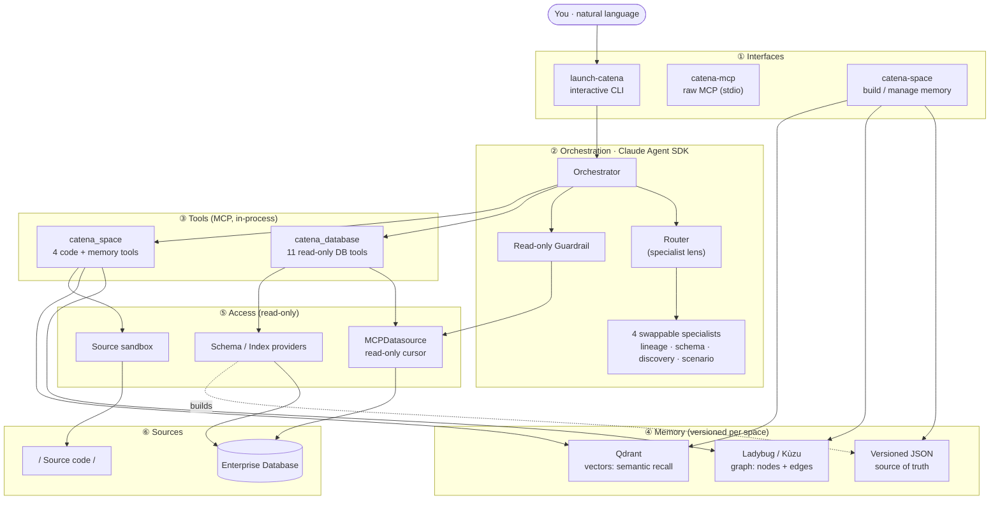

<div align="center">

# Catena

### *The Chain of Causality*

</div>

**Catena is a general-purpose, read-only, agentic assistant that learns a system from its database and the source code that drives it, then answers plain-English questions about how anything came to be.** Point it at an enterprise relational database and a code repository; it parses the code, enriches it with live schema, and builds a versioned memory — a graph of relationships plus a vector index for semantic recall. You then ask questions in a terminal ("what writes this table?", "how is this value produced?", "where is the logic for X?") and Catena reasons over real, grounded context — generating index-aware SQL behind a strict read-only guardrail — and replies with a cited answer. It is CLI-only, domain-agnostic, and never mutates anything.

---

## Table of Contents

1. [Catena at a glance (interactive deck)](#-catena-at-a-glance)
2. [How the embed works](#-how-the-embed-works)
3. [Technical architecture](#-technical-architecture)
4. [What each layer does](#-what-each-layer-does)
5. [Code design & structure](#-code-design--structure)
6. [Use case & summary](#-use-case--summary)
7. [Getting started](#-getting-started)
8. [Thanks](#-thanks)

---

## 🎞 Catena at a glance

The file [`docs/catena_presentation.html`](docs/catena_presentation.html) is a self-contained, animated 15-slide briefing on Catena. It is embedded below as a framed component sized to a comfortable viewing area:

<p align="center">
  <iframe
    src="docs/catena_presentation.html"
    title="Catena — The Chain of Causality"
    width="100%"
    height="680"
    style="border:1px solid #22d3ee44; border-radius:14px; max-width:1100px; box-shadow:0 20px 60px -30px rgba(34,211,238,.5);"
    loading="lazy"
    allowfullscreen>
  </iframe>
</p>

> 📺 **If you only see this text and not the slides**, your Markdown viewer has stripped the embed (GitHub does this — see the next section). Just open **[`docs/catena_presentation.html`](docs/catena_presentation.html)** directly in any browser for the full animated experience (arrow keys / scroll to navigate).

---

## 🪟 How the embed works

In plain English:

- The presentation is one **self-contained HTML file** — all of its styling, animation, and fonts live inside that single file, so it runs anywhere with no build step and no internet (except a web font).
- The README embeds it with an **`<iframe>`** — think of an iframe as a "window" (a frame) that displays another web page *inside* the current one. The `src="docs/catena_presentation.html"` points the window at the deck using a path **relative** to the README's location in this repo.
- `width="100%"` makes the frame stretch to the available column, `max-width:1100px` keeps it from getting unwieldy on huge monitors, and `height="680"` gives it an optimal viewing height. Together that's the "optimal width and height" component you see above.
- **The caveat:** GitHub's website (and many Markdown renderers) **sanitize** Markdown — they strip `<iframe>` and most raw HTML for security. So on github.com you'll see the fallback note, not the live slides. The embed *does* render in: VS Code's Markdown preview, JetBrains, a static-site/docs build (MkDocs, Docusaurus), or **GitHub Pages** (serve the repo and the iframe works). In every case the reliable fallback is to **open `docs/catena_presentation.html` in a browser**.

---

## 🏗 Technical architecture

Catena is six strictly-separated layers. A natural-language question flows top-to-bottom; every downward step is read-only and grounded.



**Request lifecycle** (what happens when you ask a question):

```
Question → Route (specialist lens) → Gather context (graph traversal + vector
recall + live schema) → Generate index-aware SQL → Guardrail (SELECT-only) →
Execute on a read-only cursor → Synthesize a cited answer → Remember (session memory)
```

---

## 🧱 What each layer does

| Layer | Responsibility | Key modules |
|-------|----------------|-------------|
| **① Interfaces** | How you talk to Catena. `launch-catena` is the interactive terminal; `catena-mcp` exposes the tools over stdio with no model; `catena-space` builds and manages a project's memory. | `agent/orchestrator.py`, `mcp_tools/sybase/mcp_server.py`, `cli/main.py` |
| **② Orchestration** | Built on the **Claude Agent SDK**. Routes intent to a specialist *lens*, assembles a grounded system prompt, runs the model loop under a hard timeout, and enforces the read-only contract. The four specialists are **configuration** — swap them for any domain. | `agent/orchestrator.py`, `agent/swarm_manager.py`, `agent/sub_agents.py`, `agent/prompts.py` |
| **③ Tools** | Two in-process MCP servers. **`catena_database`** (11 tools) reads schema, indexes, DDL, samples, dependencies, and runs validated SQL. **`catena_space`** (4 tools) reads source code and the memory — `read_source`, `search_source`, `search_memory`, `find_code_references`. | `agent/tools.py`, `agent/space_tools.py` |
| **④ Memory** | A per-project **space** holds a *versioned* memory. **Ladybug** (embedded Kùzu graph) answers relationship questions ("what calls/reads/writes X?"); **Qdrant** (embedded vectors, fully offline) answers semantic ones ("logic that does Y"); **versioned JSON** is the source of truth all three are derived from. | `memory/ladybug_store.py`, `memory/qdrant_store.py`, `memory/store.py`, `space/` |
| **⑤ Access** | Everything is **read-only by construction**. `MCPDatasource` opens read-only cursors (parameter-bound, row-capped, timeout-bounded); providers shape live schema/index context; the source sandbox confines file reads to the space's `source_code/`. | `mcp_tools/sybase/connection.py`, `memory/schema_provider.py`, `space/runtime.py` |
| **⑥ Sources** | The real, unchanged systems: an enterprise relational database (Sybase ASE 16 adapter by default; additional adapters are pluggable) and a source-code repository (Java parsing today, via tree-sitter with a regex fallback). Catena observes them; it never writes. | — |

Three safety invariants run through every layer: **read-only** (all SQL passes a `QueryGuard` that blocks DML/DDL/admin and statement-stacking), **bounded** (`TOP` row caps + per-query timeouts), and **no chain-of-thought leakage** (the renderer reduces "thinking" to a phase label).

---

## 🧩 Code design & structure

### Dependencies and their roles

**Core (always installed):**

| Package | Role in Catena |
|---------|----------------|
| `pyodbc` | Connects to the database via ODBC (used by the default Sybase ASE adapter; other adapters may use different drivers). |
| `pandas` | Tabular results from the query/sample tools. |
| `pyyaml` | Loads `config/*.yaml` settings. |
| `python-dotenv` | Loads the space's `database/<env>.env` connection file. |
| `pydantic` | Data validation / typed models. |
| `structlog` | Structured logging (bridged into stdlib, routed to a file). |
| `tenacity` | Retry helpers for resilient calls. |
| `mcp` | Model Context Protocol SDK (the stdio tool server). |

**Optional extras (graceful degradation if absent):**

| Extra | Package(s) | Role |
|-------|-----------|------|
| `.[agent]` | `claude-agent-sdk`, `anyio`, `httpx` | The agent brain. Model auth via `ANTHROPIC_API_KEY` (direct Anthropic API). |
| `.[parsers]` | `tree-sitter`, `tree-sitter-java/python/typescript` | High-fidelity code parsing (falls back to regex). |
| `.[graph]` | `kuzu` | The embedded graph database ("Ladybug"). |
| `.[vector]` | `qdrant-client` | The embedded vector database (local mode). |
| `.[test]` | `pytest`, `pytest-asyncio` | The test suite. |

> Embeddings use a built-in **deterministic, fully-offline hashing embedder** — no model download, no `torch`, no API keys, no network. The Sybase adapter requires `ms-sybpydb` (Linux ASE driver, internal index only) or a Kerberos ODBC DSN on Windows. Model auth is a direct Anthropic API key (`ANTHROPIC_API_KEY`).

### Project structure

```
catena/
├── mcp_tools/sybase/      ① Database adapter module — Sybase ASE implementation
│   ├── connection.py        Datasource (firm verbatim) + MCPDatasource (read-only)
│   ├── security.py          QueryGuard — read-only / row-cap / identifier guards
│   ├── index_analyzer.py    Indexes via sp_helpindex
│   ├── query_tools.py       Index-aware queries → DataFrames
│   ├── schema_tools.py      DDL reconstruction + introspection
│   ├── sample_tools.py      Random / stratified / keyed sampling
│   └── mcp_server.py        11 MCP tools (incl. get_table_context, execute_sql)
├── memory/                ④ Memory: live context + persisted + graph + vectors
│   ├── schema_provider.py   Columns, keys, row count, indexes → context block
│   ├── index_provider.py    Index metadata + (optional) fragmentation
│   ├── ladybug_store.py     Embedded graph (Kùzu): nodes + edges, lineage queries
│   ├── qdrant_store.py      Embedded vectors (Qdrant) + offline hash embedder
│   └── store.py             Versioned, atomic, deep-merging JSON store
├── sql/                   ⑤ Safety + execution for generated SQL
│   ├── guardrail.py         SqlGuardrail (composes QueryGuard); blocks DML/DDL
│   └── executor.py          SqlExecutor — read-only run, timeout + row cap
├── agent/                 ② Orchestration + terminal UX (CLI only)
│   ├── orchestrator.py      CatenaOrchestrator (+ CLI), event streaming
│   ├── tools.py             catena_database MCP server (11 tools)
│   ├── space_tools.py       catena_space MCP server (4 code/memory tools)
│   ├── sql_generator.py     SQL-generation rules + prompt/extraction helpers
│   ├── prompts.py           Orchestrator + specialist system prompts
│   ├── sub_agents.py        Swappable specialist AgentDefinitions
│   ├── swarm_manager.py     Deterministic intent routing (a hint)
│   ├── ui_events.py         Raw SDK msgs → normalized UIEvents (no CoT leak)
│   ├── activity.py          Shared live-status UX driver for all commands
│   ├── terminal_ui.py       Ephemeral live status region + gradient spinner
│   ├── panels.py            Framed input/response panels
│   ├── status_phrases.py    Sarcastic status phrases + context headers
│   └── ...                  config · logging · branding · memory (SQLite)
├── space/                 Spaces: per-project workspaces + versioning
│   ├── layout.py            Single source of truth for all paths
│   ├── version.py           v{N} snapshots + cross-platform `current` pointer
│   ├── manager.py           Façade; activates the DB env for a space
│   ├── init.py              Build memory (parse → enrich → index)
│   ├── indexing.py          Populate Ladybug + Qdrant from the JSON sections
│   ├── enrichment.py        Pull live DDL via the read-only database adapter
│   └── runtime.py           SpaceQuery — sandboxed source + memory access
├── parser/                Code parsers (language_detector, java, gradle, xml)
├── learning/              Self-learning: gap detection + versioned write-back
├── cli/                   catena-space command (create/init/status/revert/list)
├── common/                Shared, dependency-free kernel
│   └── progress.py          Neutral progress protocol (keeps layers decoupled)
├── config/                YAML config + *.env templates + expertise prompts
├── tests/                 302 passing tests (4 live-only skipped)
└── docs/                  presentation.html · sybase_mcp_api.md · agent_api.md · spaces.md
```

**Design principles:** strict layering (the database layer never knows about the UI; `space/` and `parser/` depend only on the neutral `common/progress.py`); a single source of truth (`space/layout.py` for paths, versioned JSON for knowledge); pure, unit-testable functions for rendering and parsing; and optional heavy dependencies that degrade gracefully so the core always works.

---

## 🎓 Use case & summary

Imagine a **Student Management System** (SMS): a database with tables like `STUDENT`, `COURSE`, `ENROLLMENT`, and `GRADE_RESULTS`, stored procedures like `sp_enroll_student` and `sp_calculate_gpa`, and a service application that ingests registrations, validates them, computes results, and publishes a transcript.

The hard question is rarely "what's in `GRADE_RESULTS`?" — it's **"how did this student's GPA become 3.7?"** The answer lives across code and data: a service reads `ENROLLMENT`, calls `sp_calculate_gpa` (which joins `COURSE` credits and applies a weighting rule), and writes `GRADE_RESULTS`. The intermediate steps are never stored in a table — they happen in memory and vanish. Traditionally, reconstructing that chain is hours of reading code and guessing.

With Catena, you build a space for the SMS once, then ask:

- *"What writes `GRADE_RESULTS`?"* → graph traversal returns the proc and the service method.
- *"How is a student's GPA calculated?"* → it follows the chain `ENROLLMENT → sp_calculate_gpa → GRADE_RESULTS`, reads the weighting logic from the source, and explains it — even though the intermediate values were never persisted.
- *"Show me the schema and indexes for `ENROLLMENT`."* → live structure, on demand.
- *"Find the code that handles late registrations."* → semantic search over the source and procs.

**In summary:** Catena turns a sprawling, undocumented system into something that can explain itself — instantly, safely (read-only), and grounded in the real schema and code. Onboard in hours instead of months; audit and trace with confidence; and never fear that a question will change anything.

---

## 🚀 Getting started

> Prerequisites: an editable install (`pip install -e ".[all]"` from the `catena/` directory) and an activated virtualenv. On Windows, the bootstrap `./setup.ps1` creates the venv and installs the console scripts.

### 1. Create a space

A *space* is a per-project workspace under `~/.catena/spaces/<name>/`.

```powershell
catena-space create sms
```

This prints where to drop your code and DB config:

```
Space 'sms' created at C:\Users\you\.catena\spaces\sms.
  Drop source under ...\spaces\sms\source_code (java/ python/ typescript-angular/)
  Add DB env files under ...\spaces\sms\database (e.g. dev.env, uat.env)
  Then run: init-sms
```

### 2. Add your source code and database config

```powershell
# Copy your repo into the space's java folder:
#   ~/.catena/spaces/sms/source_code/java/sms-service/   (must contain build.gradle / pom.xml)

# Create the DB connection file ~/.catena/spaces/sms/database/uat.env :
#   SERVER=YOUR_DATABASE_SERVER
#   DATABASE=SMS
```

### 3. Build the memory

This parses the code, enriches it with live schema/proc DDL (read-only), and builds the graph + vector indexes — all shown with an animated live status panel (press **Ctrl+O** during the run to see the file currently being scanned).

```powershell
catena-space init sms --complete --env uat        # full build (v1)
# later, incremental updates that only parse new modules:
catena-space init sms --env uat
```

Inspect what was learned:

```powershell
catena-space status sms
```
```
Space 'sms' memory (v1):
  components: 1 (sms-service)
  tables known: 24
  procs known: 18
  versions: [1]  (current: v1)
  graph (ladybug): 31 tables, 22 procs, 540 methods, 1 components, 870 edges
  vectors (qdrant): 540 code, 18 procs, 24 schema [hash dim=256]
```

### 4. Launch Catena and ask a question

```powershell
launch-catena --space=sms --env=uat
```

**Sample prompt:**

```
> How is a student's GPA calculated, and what writes GRADE_RESULTS?
```

**Sample expected output:**

```
──────────────────────────────────────────── RESPONSE ────────────────────────────────────────────
GRADE_RESULTS is written by the stored procedure sp_calculate_gpa, which is invoked by
GradeService.publishResults() (sms-service).

Lineage of GRADE_RESULTS.gpa:
  Stage 1  ENROLLMENT          ← read by sp_calculate_gpa
  Stage 2  sp_calculate_gpa    joins COURSE.credits, applies the weighting rule
                               gpa = Σ(grade_points × credits) / Σ(credits)   (transient)
  Stage 3  GRADE_RESULTS       ← written by sp_calculate_gpa  (published)

Sources: sp_calculate_gpa (DDL), GradeService.java:142 (calls the proc), COURSE / ENROLLMENT schema.
Note: the per-course weighted values are computed in-proc and never stored — reconstructed from the
proc body and the call graph.
───────────────────────────────────────────────────────────────────────────────────────────────────
($0.04 · 3 turns · 5 activity steps — type 'details' to expand)
```

In-session commands: `details` (or **Ctrl+O** during a run) expands the activity transcript, `clear` resets conversation memory, `exit` quits. Flags: `--verbose`, `--debug`.

---

## 🙏 Thanks

Thanks for reading — and for looking at **Catena**. If a system can tell its own story, the people who maintain it get their time back. That's the whole idea.

> *"Where the story ends is where I begin."*
